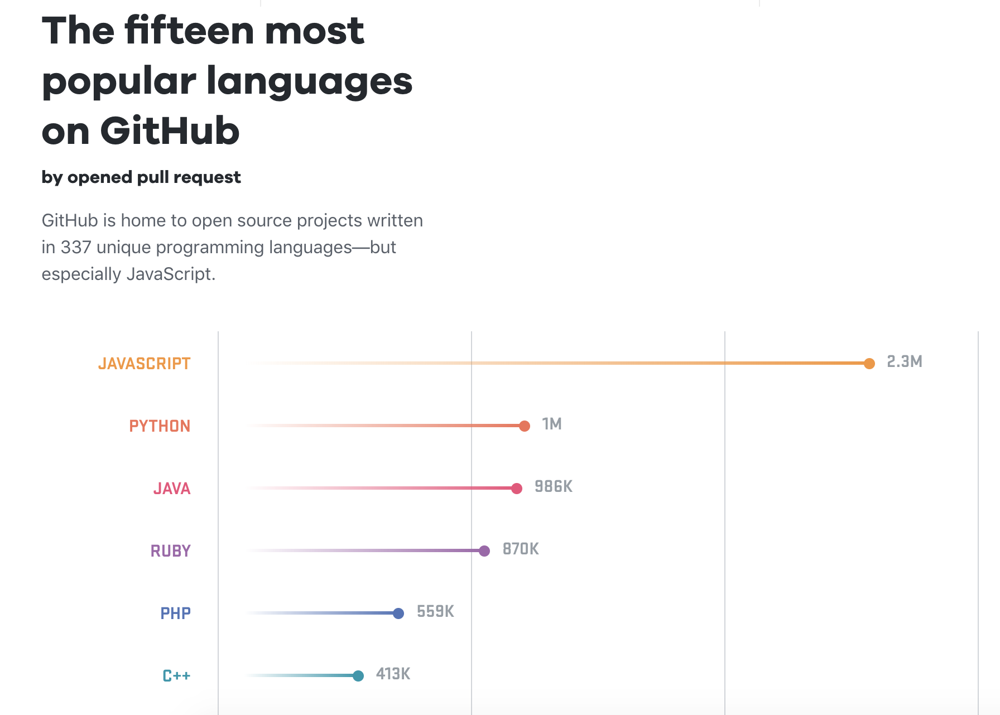
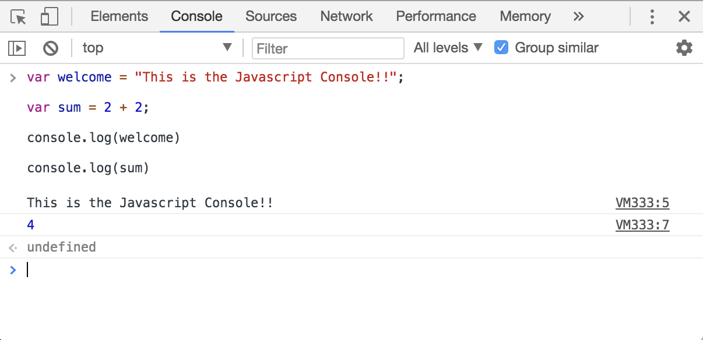

# Javascript Guides
Now that your enviroment is all set up and you know the command line fundamentals, we can begin to learn how to code!

# Contents 
- [2.1 Basics](#basics)
- [2.2 Intermediate]()
- [2.3 Editor](#editor)
- [2.4 Style Guides](#style-guides)
- [2.5 ES2015/ES2016/ES2017...]()

# Javascript Guides

Javascript is one of the worlds most popular programming languages, and the shear number of developers Javascript effects is astonishing.

Being able to understand, read and write Javascript is a very rewarding skill to have. Hundreds of millions of dollars are being poured into the development of Javascript by the worlds largest corporations such as Google, Facebook and Apple every single year, and at the time of writing this Javascript is the most popular language on GitHub.

In it's core, Javascript is an object-oriented programming languages and very similar to other languages in the same category such as Python, Swift and Ruby. Javascript is the language while *Node.JS* is the enviroment that lets Javascript run on a server instead of a webbrowser. 

## Basics
If you understand Javascript and can read and write is comfortably, you may skip to the next section: [Style Guides](#style-guides)

 

    :star: *A VERY POWERFUL TOOL TO LEARN JAVASCRIPT IS THE JAVASCRIPT CONSOLE* :star:

---

Before you begin learning Javascript, a great tool to use us the console. Every modern browser has a Javascript console... Think of it like a "sandbox" where you can play with Javascript code.

If you use _*Google Chrome*_ an easy way to bring up the Javascript Console is use the keyboard shortcuts:

On Windows and Linux: `Ctrl + Shift + J`. 

On Mac: `Cmd + Option + J`.

---

Let's begin by learning the javascript basics such as variables, types, operations/operands and functions.

[Start by reading this introduction to javascript](https://autotelicum.github.io/Smooth-CoffeeScript/literate/js-intro.html#syntax-basics)

## Intermediate

## Editor

Aside from your Terminal, the single best tool at your disposal for developing is your Editor!

Having a modern editor will help you write code faster and more efficiently.

Over the last couple of years there has been a lot of great editors, I strongly recommend `Microsoft VS Code` as it has provded to be a fast, efficient editor that has a crazy good development team making it better and better.

Here is a list of editors starting with my favorites towards the top.

- [Microsoft's VS Code](https://code.visualstudio.com/)
- [GitHub's Atom](https://atom.io/)
- [Sublime Text](https://www.sublimetext.com/)

## Style Guides

As you start to write your code, it's very easy to be inconsistent in the way you write it.

Being aware of the format in which you write your code is quintessential to having readable and friendly code.

Ultimately the style in which you want to write your code its entirely up to you, and does not matter much, however what _does_ matter is being consistant.

Now that you know about Javascript and how to write it you should take a look at the following 2 stype guides

### Standard Style Guide
[StandardJS](https://github.com/standard/standard)
### Airbnb Style Guide
[Airbnb Style Guide](https://github.com/airbnb/javascript)

## Style Guide Tools
Now that you have decided on which style to go with, you can look for tools to help you enforce the style.

Most modern editors have addons that help you enforce specific style guides.

You can search for the addon directly in yoru editors package manager, for now I will list a link to the VS Code packages

- [Standard](https://marketplace.visualstudio.com/items?itemName=chenxsan.vscode-standardjs)
- [ESLint (good for Airbnb style)](https://marketplace.visualstudio.com/items?itemName=dbaeumer.vscode-eslint)
- [JSHint](https://marketplace.visualstudio.com/items?itemName=dbaeumer.jshint)
- [Prettier](https://marketplace.visualstudio.com/items?itemName=esbenp.prettier-vscode)