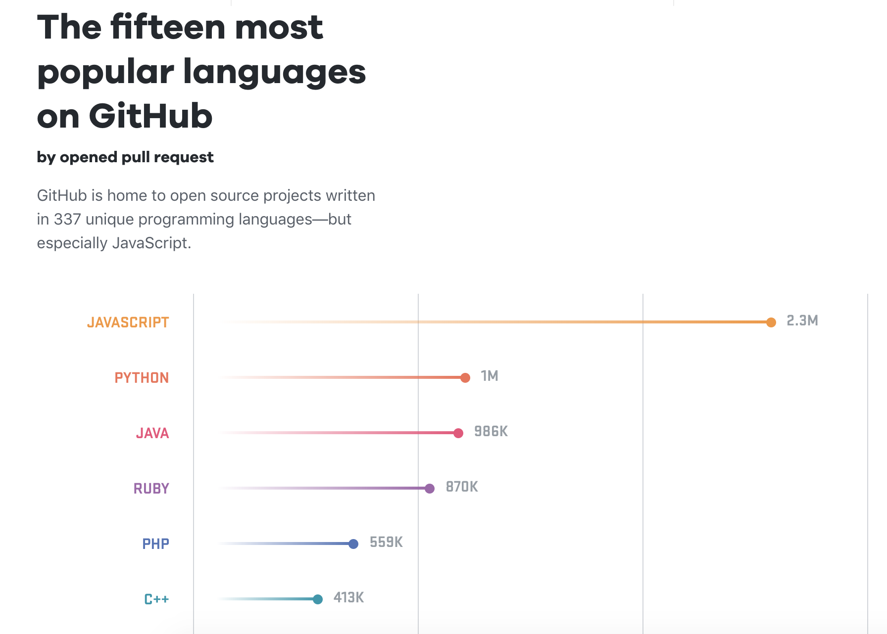
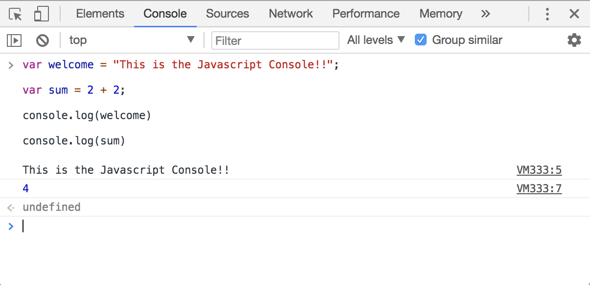

# NodeJS
Now that your enviroment is all set up and you know the command line fundamentals, we can begin to learn how to code!

# Contents 
- [2.1. Javascript Guides]()
  - [Basics]()
  - [Intermediate]()
  - [Style Guides]()
  - [ES2015/ES2016/ES2017...]()
- [2.2. Installation & NVM]()
  - [Installing NVM]()
  - [Installing Node]()
- [2.3. NPM & Packages]()
  - [Concept of Packages]()
  - [package.json]()
  - [node_modules]()
  - [npmjs.com & github packages]()
- [2.4. Initiating Project]()
  - [npm init]()
  - [git init]()
- [2.5. Hello World App]()
  - [app.js]()
  - [npm install ]()
  - [running application]()
  - [npm scripts]()
- [2.6. Web App]()
  - [Requests & Responses]()
  - [Router]()
  - [Middleware]()
  - [Controllers]()
  - [Components]()
  - [Views]()
  - [Static Files]()
  - [Headers & Cookies]()
  - [Database]()
  - [GZip Compression & Optimizations]()
  - [SSL & Security]()

# Javascript Guides

Javascript is one of the worlds most used programming languages, it has taken a evolved many times throughout the years, and the shear number of developers Javascript effects is astonishing.

Being able to understand, read and write Javascript is a very rewarding skill to have. Hundreds of millions of dollars are being poured into the development of Javascript by the worlds largest corporations such as Google, Facebook and Apple every single year, and at the time of writing this Javascript is the most popular language on GitHub.

In it's core, Javascript is an object-oriented programming languages and very similar to other languages in the same category such as Python, Swift and Ruby. Javascript is the language while *Node.JS* is the enviroment that lets Javascript run on a server instead of a webbrowser. 

> It is important to differentiate between Javascript in the browser and Javascript in the server/command-line

When learning Javascript it's very important to be aware of what types of tutorials you're so you do not get confused.

 

    :star: *A VERY POWERFUL TOOL TO LEARN JAVASCRIPT IS THE JAVASCRIPT CONSOLE* :star:

---

Before you begin learning Javascript, a great tool to use us the console. Every modern browser has a Javascript console... Think of it like a "sandbox" where you can play with Javascript code.

If you use Google Chrome an easy way to bring up the Javascript Console is use the keyboard shortcuts:

On Windows and Linux: `Ctrl + Shift + J`. On Mac: `Cmd + Option + J`.

## Basics

Its important to learn javascript basics such as variables, variable types, operations/operands and functions.

[Mozilla has a great tutorial here!](https://developer.mozilla.org/en-US/docs/Learn/Getting_started_with_the_web/JavaScript_basics#Language_basics_crash_course)