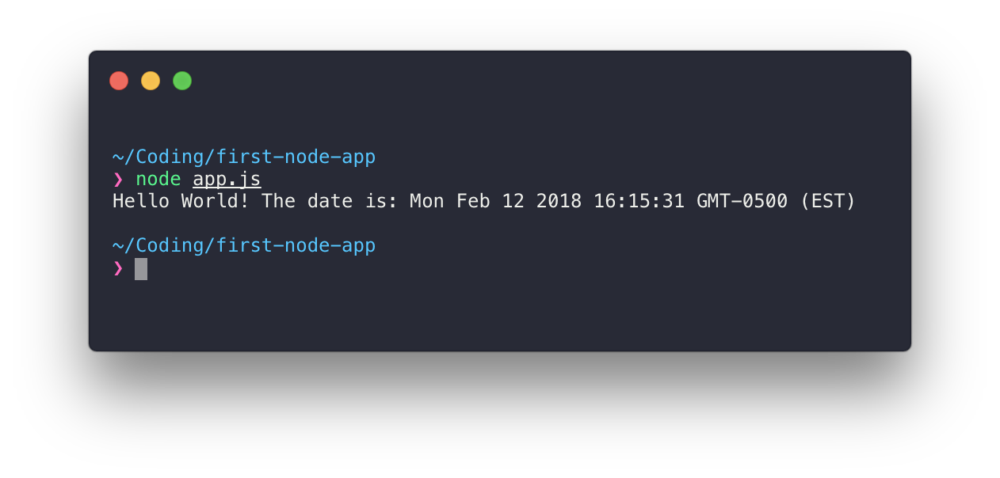
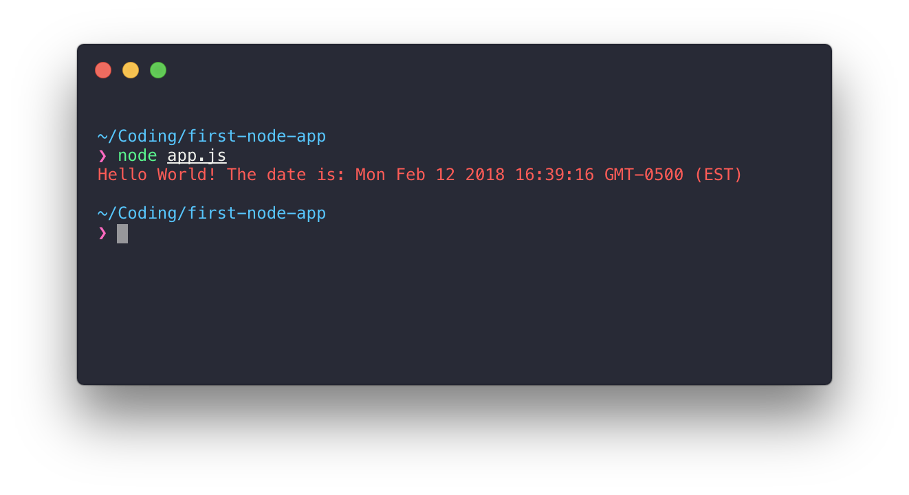

# NodeJS

Lets start making your own NodeJS Apps!

<br>
<div>
  <a href="../README.md#contents">:arrow_left: Back to Main Menu</a>
</div>

# Contents
- [3.1. Installing Node & NVM](#installing-node-nvm)
  - [Install NVM](#install-nvm)
  - [Install Node](#install-node)
- [3.2. NPM & Packages](#npm-packages)
  - [Concept of Packages](#npm-packages)
- [3.3. Initiating Project](#initiating-project)
- [3.4. Hello World App](#hello-world-app)
  - [app.js](#appjs)
  - [npm install ](#npm-install)
  - [npm scripts]()
- [3.5. Web App]()
  - [Requests & Responses]()
  - [Router]()
  - [Middleware]()
  - [Controllers]()
  - [Components]()
  - [Views]()
  - [Static Files]()
  - [Headers & Cookies]()
  - [Database]()
  - [GZip Compression & Optimizations]()
  - [SSL & Security]()

# Installing Node & NVM

**NVM** (_Node Version Manager_) is a handy tool that lets you manage multiple(or just one) version of node on yoru system. It's the easiest way to get Node installed.


## Install NVM
To install NVM fire up your terminal and type in the following:

``` bash
curl -o- https://raw.githubusercontent.com/creationix/nvm/v0.33.8/install.sh | bash
```

or if you prefer wget:

``` bash
wget -qO- https://raw.githubusercontent.com/creationix/nvm/v0.33.8/install.sh | bash
```

After the installation is complete, we need to reload your Bash shell so type in:

``` bash
source ~/.bashrc
```

## Verify
Now to verify you have NVM running on your system type:

``` bash
command -v nvm
```

which should output 'nvm' if the installation was successful. 

[If you have problems installing NVM or are experiencing any sort of errors, read the installation instructions straight from NVM here.](https://github.com/creationix/nvm#install-script)

## Install Node

Now that we have NVM running, installing Node couldnt be easier.

Simple run: 

``` bash
nvm install node
```

This will download, compile and install the latest version of node!

# NPM & Packages

We should now have a working copy of Node on our system and can proceed to learn about packages.

## Concept of Packages

Every NodeJS application is considered a "package". All of them. Regardless of what type of app it is, it's a package.

The beauty of NodeJS is: there are thousands and thousands of open-sourced packages that you can simply add to your application. Everytime someone in the world creates a piece of code that can be used for something, they can package it up and share it with the world. So at your fingertips you have all these packages you can use to accomplish just about anything.

When you write your very own NodeJS application, 100% of the time you will use packages from other users all over the world. All the *hard* parts of coding, have usually already been taken care of by other users and you can simply add a package to your application to take advantage of that.

> The takeaway here is: your app is a application(package) comprised of other packages from other users.

We will take a further look into packages in the next section as we create our first NodeJS app.

# Initiating Project

Lets create our first NodeJS app.

## Step 1: Create Directory

Lets create a folder for our nodejs app:

``` bash
mkdir first-node-app
cd first-node-app
```

## Step 2: Initiate App

Lets create an application file:

``` bash
  touch app.js
```
> This simply creates an empty file for you, this is where we are going to write our code.

Now Node has a very handy tool called *NPM* we can use in our terminal. So lets run the following:

``` bash
npm init
```
> Now NPM will ask you a series of questions regarding your new app. For the purpose of this tutorial you can simple press **[ENTER]** for every question to use the default settings.

Now if you type `ls -l` in your directory you should have the following:

``` bash
❯ ls
app.js       package.json
```

Sweet! Now lets go over the structure of a node application.

The structure of a nodejs application usually consists of the following:

- A NodeJS App file (e.g. app.js or server.js)
- A NodeJS Package file (package.json)
- node_modules (a directory filled with other NodeJS packages from other users)

The `App file` is where you write your code.

The `Package file` is where you describe your application, and include all the other packages you wish to use

The `node_modules` folder is where all the packages you use will be installed to.

This is the very basic structure of every application. All Node apps require these 3 fundamental things.

# Hello World App

Alright alright alright.... lets make your firsy NodeJS app!

## app.js

Open up `app.js` using your editor of choice.

Type in the following lines inside your file:

``` javascript
let today = new Date();

console.log("Hello World! The date is: " + today);
```
> new Date() is a function built into node, it simply creates a "Date" object with todays date and time :) Simple enough.

<br>
Save that file and go back to your terminal.

Now type: 
``` bash
node app.js
```

You should see:

<div align="center">
  
  <blockquote>Nice! You just ran your very first node application and it did something useful, it told you the current date and time.</blockquote>
</div>

<br>

## NPM Install

So remember how we said a node app is simply a package compromised of other packages?

Lets see an example of how you can use someone elses Package inside of your package:

``` javascript
let today = new Date();
let chalk = require('chalk'); // This is a package named Chalk created by a user. It lets you write messages in different colors.

console.log(chalk.red("Hello World! The date is: " + today));

```
> In this simple application we wrote our own app that uses a package from another user called "chalk".
>
> We simply are displaying the date and time in red text..

<br>

Now lets run it again:

```
node app.js
```

<br>

<div align="center">
<p><b>:boom:Boom!:boom:</b> :rotating_light:Your first NodeJS Error!:rotating_light: </p>
<p>At first it may seem that errors are your sworn enemy. But they're not!</p>
<p><b>Errors are your friends! Errors are _extremely_ useful in telling your what went wrong!</b></p>
</div>

<br>

Once you learn to read errors, they becoming **incredibly** easy to fix!
Lets read this first error:

``` bash
Error: Cannot find module 'chalk'
    at Function.Module._resolveFilename (module.js:489:15)
    at Function.Module._load (module.js:439:25)
    at Module.require (module.js:517:17)
    at require (internal/module.js:11:18)
    at Object.<anonymous> (/Users/kenneth/Coding/first-node-app/app.js:2:13)
    at Module._compile (module.js:573:30)
    at Object.Module._extensions..js (module.js:584:10)
    at Module.load (module.js:507:32)
    at tryModuleLoad (module.js:470:12)
    at Function.Module._load (module.js:462:3)
```

The most important line there is the very first line, every other line is just debugging information we usually do not need.

`Error: Cannot find module 'chalk'` is actually quite easy to understand. Its telling us that we used the package "chalk" but it has aboslutely **_no_** idea what the heck chalk is.

Awesome! So lets segue into the package.json file and how we can tell Node what `chalk` is...

<br>

<div align="center">
   
</div>

<br>

The *NPM* tool we used to initiate our project is actually a central hub for all Node Packages. When someone creates a package and they want to share it, they submit it to NPM and then people can install those packages into their app.

We want to install `chalk` so we can use it inside our app so all we have to do it type in our terminal:

```
   npm install --save chalk
```

Now *NPM* downloaded chalk and put it into a folder called `node_modules`

So if were were to run our app again ..

```
node app.js
```

You should see:

<div align="center">
  
  <blockquote>Nice! We got the red letters! :sunglasses:</blockquote>
</div>

<br>
<div>
  <a href="#contents">:arrow_up: Back to Top</a>
</div>
<br>
<div>
  <a href="../README.md#contents">:arrow_left: Back to Main Menu</a>
</div>