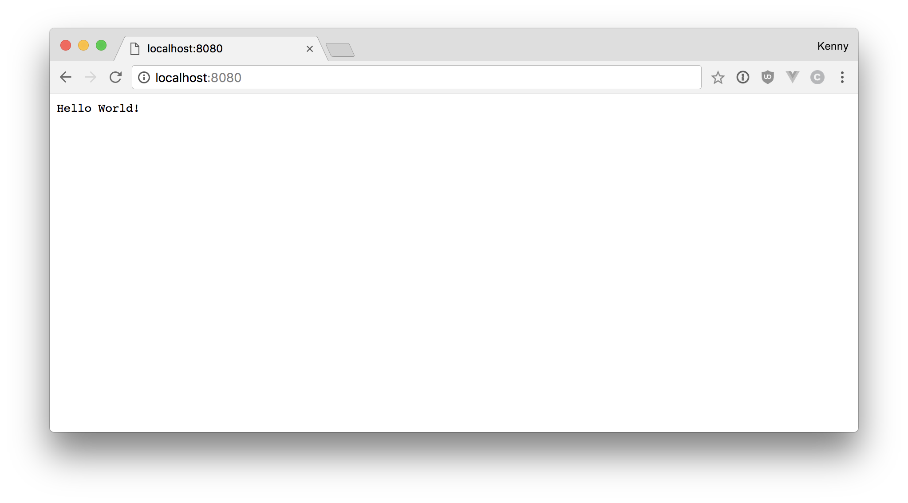

# NodeJS Webserver 

Now that we understand the basics of webserver communication, we are ready to implement a webserver using NodeJS.

This is the meat and potatoes of the guide as we begin to write out webserver from scratch.


# Contents
<div>
  <a href="../README.md#contents">:arrow_left: Back to Main Menu</a>
</div>
<br>

- [5.1 Requests & Responses]()
- [HTTP Framework](#http-framework)
- [5.2 Router]()
- [5.3 Middleware]()
- [5.4 Controllers]()
- [5.5 Components]()
- [5.6 Views]()
- [5.7 Static Files]()
- [5.8 Headers & Cookies]()
- [5.9 Database]()
- [5.10 GZip Compression & Optimizations]()
- [5.11 SSL & Security]()

# Requests & Responses

If you do not understand the basics of webserver communication (ie requests & responses) please read over [Webserver Fundamentals](../Webserver/README.md).

The first thing we need to do is create a simple HTTP server that can receive a requests and send a response.

Before we get into HTTP frameworks, lets create a bare minimum HTTP server using the native NodeJS API.

## Step 1. Setup

Lets setup a directory for our project, begin my making a directory in a folder you would like to start in..

``` bash
  mkdir node-webserver

  cd node-server/
```

Now lets create an server file and initiate NPM in the directory.

``` bash
touch server.js
npm init
```

Go through NPM init with the default settings (you can simply press Enter on each prompt)..

## Step 2. Simple Server

Now open up `server.js` in your editer of choice and lets create the most simple HTTP server possible..

``` javascript
let http = require('http');

http.createServer(function (request, response) {
  response.writeHead(200, {'Content-Type': 'text/plain'});
  response.write('Hello World!');
  response.end();
}).listen(8080);

console.log('Running server on http://localhost:8080');
```

Here we are using the native HTTP package that comes with node.

We are then using the createServer function from the HTTP package that simply create a server where you can easily handle a request and issue a response.

Now no matter what type of request the server receives we will always answer back with a response that says `Hello World!`.

Save this file and in your terminal lets run it using node.

``` bash
node server.js
```

You should see the output from the terminal read `Running server on http://localhost:8080`

Now if you open up your browser and go to `http://localhost:8080` you should see your response!

<div align="center">
  
</div>

You now have a simple HTTP server accepting requests and sending back a response,

The response here can be anything you like, for instance you can send the browser HTML and it will render html

``` javascript
http.createServer(function (request, response) {
  response.writeHead(200, {'Content-Type': 'text/html'});
  response.write(`
    <h1>Hello</h1>
    <h3>This should be rendered as HTML</h3>
  `);
  response.end();
}).listen(8080);
```

You can even send an entire webpage to the browser.

``` javascript 
http.createServer(function (request, response) {
  response.writeHead(200, {'Content-Type': 'text/html'});
  response.write(`
    <!DOCTYPE html>
    <html lang="en">
    <head>
      <title>Test</title>
    </head>
    <body>
      <div align="center">
          <h1>This is your homepage</h1>
    
          <p>My favorite websites are:</p>
          <ul style="width: 200px; text-align: left;">
              <li><a href="https://www.github.com">Github</a></li>
              <li><a href="https://www.stackoverflow.com">StackOverflow</a></li>
              <li><a href="https://www.twitter.com">Twitter</a></li>
          </ul>
      </div>
    </body>
    </html>
  `);
  response.end();
}).listen(8080);
```

This example is great to demonstrate communicating back and forth to the browser, however as you probably have realized by now it's not very organized.

In the next section we will go over how to handle _different_ types of requests and begin add structure to your server.

# HTTP Framework

The native `http` package we used in the first section is a great low-level way of creating a HTTP server and handling requests. 

However, there are a great variety of HTTP frameworks which have built on top of the native package and have added more funcationality and have made it even easier to build HTTP frameworks.

Some of the most popular are:

- [Koa](https://github.com/koajs/koa)
- [Express](https://github.com/expressjs/express)
- [Fastify](https://github.com/fastify/fastify)

# Router

In this tutorial we are going to continue with the [Koa](https://github.com/koajs/koa) HTTP framework, the way we organize and set up our servers can really be done with just about any HTTP framework you choose. Each have their own quirks but they essentially function the same way and have the same features for the most part.

A `router` in an HTTP Web Server is in charge of routing the request to the correct section of the code. When you have hundreds of different requests coming in you have to make sure that each request gets sent to the correct piece of code to run. 

A `router` uses nothing else except URL of the request to determine where the request should go, so we have to setup `router` rules in place to anticpate every type of URL..

How you create the rules for the `router` could be subjective, in this tutorial I will show you a method that has worked well for me in the past.

```
https://www.yourwebsite.com/login

www.yourwebsite.com        /login
         |                    
       Server
```