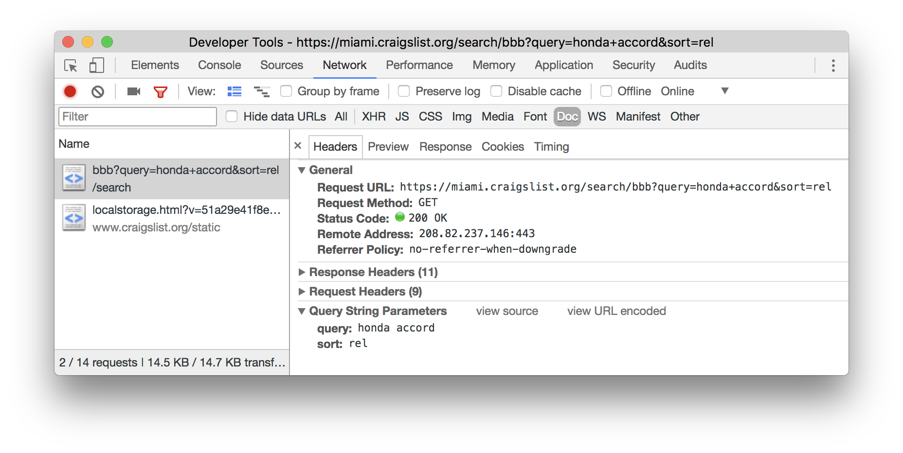

# Webserver Fundamentals

Before we begin writing our own NodeJS webserver, we need to understand  what a webserver does.

In this section we will go over the fundementals of webserver communication with a browser.

# Contents

- [4.1 Communication](#communication)
- [4.2 Requests](#requests)
- [4.3 Responses]()

# Communication

I have often thought about what is the most simplistic way of describing the communication between a browser and a web server. When you want to start web development, this is obviously a fundamental aspect of web dev you need to grasp, how your server and the user's client interact with one another.

Without getting into Domain Name Systems.. I believe the best way to think of communication is in two parts: `Requests` & `Responses`.

<div align="center">
    
</div>

The first thing a web browser (client) does when it visits a homepage is it **Requests** a webserver for all of the information. It requests for the content of the webpage, the styles, the javascript, the images and documents. It sends a request for everything you see on a website.

A webservers sole purpose is to accept and read every single request, and issue an appropriate **Response** to the client for each **Request**. When creating a webserver you have to set rules in place so that you can appropriately handle any request sent it's way.

Lets break down how **Requests** and **Responses** are structured.

# Requests

To understand **Requests** it helps by simply looking at one in action. Lets try doing a search on a classified website such as craigslist. When we do a search for an item, lets say `"Honda Accord"` the website sends a **Request** to a webserver asking it for classifieds that include `"Honda Accord"`.

Using the [Chrome Dev Tools](https://developer.chrome.com/devtools) we can monitor the Network activity and see the **Request**.

<div align="center">
    
</div>

The most important part of a request is a URL, in fact in most cases a request can contain no data other than the data on the URL. The URL of the request contains the address of the webserver you're sending it to, as well as the specific data you want from it.

Let's break down the URL in this example:


```
https://miami.craigslist.org/search/bbb?query=honda+accord


 https      miami.craigslist.org      /search/bbb      ?query=honda+accord
   |                  |                    |                    |
   |                  |                    |                    |
 schema              host                 path           query parameters
```

| Section | Description |
| ------- | ----------- |
| schema | Protocal of the request, in this case we are using `HTTPS` |
| host | This is the address for the webserver, where we are sending this request to. Usually a domain name, but can simply be an IP Address |
| path | This tells the host the specific resource we want from it, in this case we want to do a search |
| query parameters | This gives additional information for the resource we are requesting, in this case the search term  `Honda Accord` |